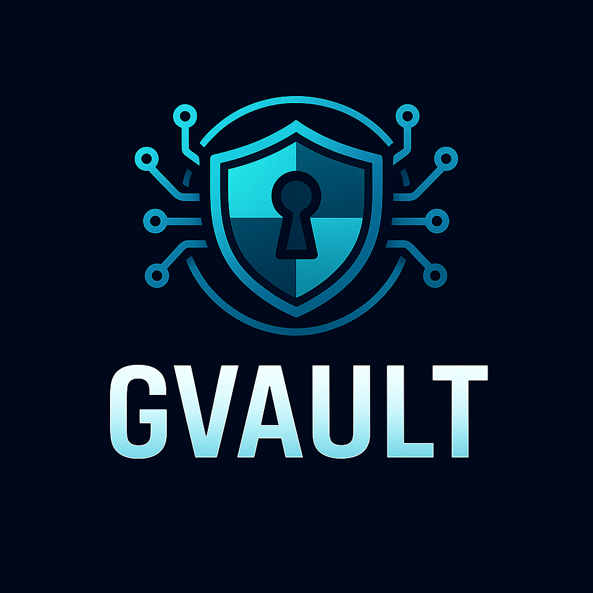

<div align="center">
  

  # GVault

  **🔐 The Ultimate Terminal Keychain Manager**

  [](https://ziglang.org/)
  [](https://www.openssh.com/)
  [](https://gnupg.org/)
  [](https://github.com)
  [](https://github.com)
  [](https://github.com)

  *Secure credential management library designed specifically for terminal emulators and home lab workflows*
</div>

## 🚀 Vision

GVault is a next-generation credential management system built for power users, terminal enthusiasts, and home lab administrators. Unlike general-purpose password managers, GVault focuses on the credentials that matter most in terminal workflows: SSH keys, GPG keys, API tokens, and server configurations.

**Mission**: Build the most secure, efficient keychain manager optimized for terminal emulators and home lab workflows.

## ✨ Key Features

### 🔐 **Advanced Security**
- **ChaCha20-Poly1305** encryption with Argon2id key derivation
- **Hardware Security Module** support (YubiKey, TPM)
- **Memory protection** with mlock() and secure zeroing
- **Session isolation** and auto-lock capabilities
- **Comprehensive audit logging** for all operations

### 🔑 **SSH Key Management**
- **SSH Agent Protocol** implementation
- **Automatic key loading** based on server patterns
- **Key generation** (RSA, Ed25519, ECDSA)
- **Seamless integration** with terminal workflows
- **Multi-server management** with profile support

### 🛡️ **GPG Integration**
- **GPG key generation** and management
- **Git commit signing** automation
- **Data encryption/decryption** operations
- **Identity management** with multiple keys

### ⚡ **Terminal Optimized**
- **Ghostshell integration** (planned)
- **TUI credential picker** with hotkey support
- **Secure clipboard** operations with auto-clear
- **Server profile management** with jump hosts
- **Session recording** with credential sanitization

## 🏗️ Architecture

GVault is built in Zig for maximum performance and security:

```zig
const gvault = @import("gvault");

// Initialize vault
var vault = try gvault.Vault.init("/home/user/.config/vault", "master_pass");
defer vault.lock();

// Generate SSH key with auto-loading
const key_id = try vault.generateSshKey(.{
    .type = .ed25519,
    .name = "production-server",
    .auto_load = true,
    .server_patterns = &.{"*.prod.example.com"},
});
```

## 🛠️ Development Roadmap

### 📅 **Phase 1: Foundation** (Week 1-2)
- [x] Project scaffolding and build system
- [ ] Secure storage backend with encryption
- [ ] Basic credential types and metadata
- [ ] Core CRUD operations

### 📅 **Phase 2: SSH Integration** (Week 3-4)
- [ ] SSH key management and generation
- [ ] SSH Agent Protocol implementation
- [ ] Auto-loading for server connections
- [ ] Pattern matching for credentials

### 📅 **Phase 3: GPG Integration** (Week 5-6)
- [ ] GPG key support and operations
- [ ] Git commit signing integration
- [ ] Encryption/decryption functionality

### 📅 **Phase 4: Terminal Integration** (Week 7-8)
- [ ] Ghostshell-specific features
- [ ] Clipboard management with security
- [ ] Server profile management
- [ ] TUI components

### 📅 **Phase 5: Security Features** (Week 9-10)
- [ ] Hardware Security Module support
- [ ] Comprehensive audit logging
- [ ] Key rotation and expiration
- [ ] Advanced security hardening

## 🎯 Performance Targets

- **Unlock speed**: < 100ms for 1000 credentials
- **Search performance**: < 10ms for pattern matching
- **Key generation**: < 1s for RSA-4096
- **Memory usage**: < 10MB for 1000 credentials
- **Zero allocations**: During normal operations

## 🏠 Home Lab Use Cases

### **Multi-Server Management**
```bash
# Connect to any server instantly
ghostshell connect prod-db  # Auto-loads correct key, jump hosts, etc.
```

### **Bulk Key Operations**
```bash
# Generate keys for entire infrastructure
gvault generate-fleet --servers=servers.txt
```

### **Secure Session Recording**
```bash
# Record SSH sessions with credentials safely stripped
ghostshell record production-debug --vault-sanitize
```

## 🔧 Installation & Building

### **For Zig Projects (Recommended)**
```bash
# Add gvault as a dependency to your Zig project
zig fetch --save https://github.com/ghostkellz/gvault/archive/refs/heads/main.tar.gz

# Then import in your build.zig
const gvault = b.dependency("gvault", .{});
exe.root_module.addImport("gvault", gvault.module("gvault"));
```

### **For Development**
```bash
# Clone the repository for development
git clone https://github.com/ghostkellz/gvault.git
cd gvault

# Build the library and CLI
zig build

# Run tests
zig build test

# Install locally
zig build install
```

## 📋 Requirements

- **Zig**: 0.16.0-dev.164+ (latest development version)
- **Linux/macOS/Windows**: Cross-platform support
- **Terminal**: Any modern terminal emulator

## 🤝 Contributing

GVault is designed for the terminal power user community. Contributions are welcome in all areas:

- **Core library development** in Zig
- **Security auditing** and hardening
- **Terminal integration** and UX improvements
- **Documentation** and tutorials
- **Testing** across different platforms

## 📄 License

This project is licensed under the MIT License - see the [LICENSE](LICENSE) file for details.

## 🙏 Acknowledgments

- **Zig Language Team** for the incredible systems programming language
- **OpenSSH Project** for SSH protocol references
- **GnuPG Project** for cryptographic standards
- **Terminal Emulator Communities** for inspiration and feedback

---

<div align="center">
  <strong>🔐 Let's build the ultimate terminal keychain manager that makes SSH feel magical! 🔐</strong>
</div>
